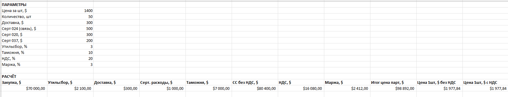

# iPhone Cost Calculator 📱💰

Инструмент для расчёта полной себестоимости и продажной цены iPhone 📊

## 🎯 Возможности

✔ Автоматический расчёт:
- себестоимости без НДС
- таможни
- утильсбора
- сертификатов (024 / 020 / 037)
- маржи
- итоговой стоимости партии
- цены за 1 шт с НДС и без НДС

✔ Все параметры редактируются прямо в Excel  
✔ Итог автоматически **открывается в Excel**
✔ Поддержка 50+ устройств без ограничений

---

## ⚙️ Технологии

| Технология | Использование |
|----------|----------------|
| Python | Скрипт генерации |
| OpenPyXL | Создание Excel |
| Git + GitHub | Версия и релизы |
| PowerShell DevOps | Авто-commit/save |

---

## 🚀 Быстрый старт

```bash
git clone https://github.com/bondaraumikita-debug/iPhoneCostCalculator.git
cd iPhoneCostCalculator
python iphone_cost_calc.py
```

Excel создастся автоматически:  
📄 `iPhone_17_Pro_Max_Calc.xlsx`

---

## 🧠 Авто-commit + push (DevOps)

Одна команда делает всё:

```bash
git save
```

- добавляет изменения
- создаёт коммит с датой/временем
- пушит в GitHub

---

## 🧾 Лицензия

MIT License — использовать свободно ✔

---

## 🌱 Roadmap

- Добавить поддержку разных моделей
- API курсов валют USD→BYN/PLN/RUB
- График структуры себестоимости
- Экспорт КП в PDF

---

💬 Если проект полезен — поставь ⭐ на GitHub!  
## 📊 Excel Preview

Визуальное отображение расчётов себестоимости:

